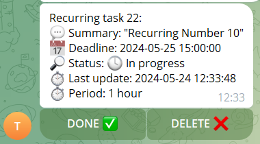
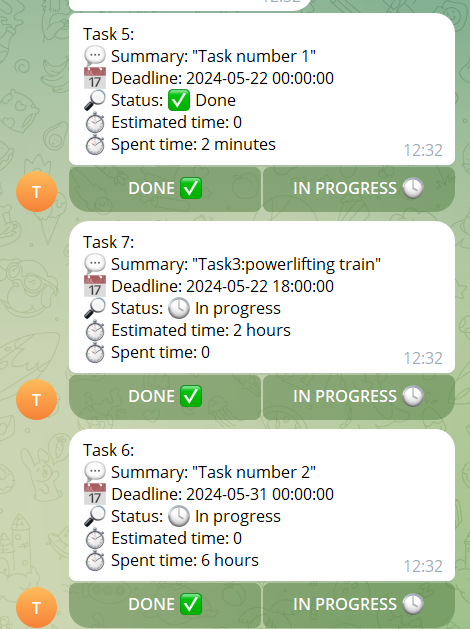
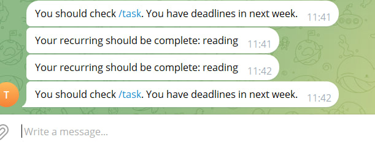

# Task Management Bot

## Dependencies
 - TelegramAPI java;
 - Spring Web Flux;
 - JOOQ;
 - PostgreSQL;

### Common possibilities:
 - Use /help in the telegram bot to run it.
 - Now we will provide token of bot to test it.

### Features
1. Task
   - Create task (summary, estimation, deadline)
   - Update task (add spent time, mark as done, change deadline)
   - Show tasks by deadline (today, tomorrow, week)
2. Recurring tasks
   - Create recurring tasks (hourly, daily, weekly, monthly)
   - Show recurring tasks
   - Update recurring tasks
   - Delete recurring tasks
3. Reminder
   - Remind about deadlines
   - Remind about not updated tasks

---

## Commands review:

- /task_create
Creating new task. Use next: /task_create [Summary] [Deadline] [Estimated time] (/task_create Driving exam 2023-05-12T12:00:00Z 10 hours)

- /reschedule
Reschedule existing recurring task. Use next: /reschedule [Recurring Id] [hourly\daily\weekly\monthly] [Deadline] (/reschedule 10 daily 2024-05-30T12:00:00Z

- /task
Show all tasks.

- /task_deadline
Change deadline for task. Use next: /task_deadline [Task_id] [Deadline] (/create_task 2023-05-12T12:00:00Z)

- /recurring
Get recurring tasks in progress. Use next: /recurring

- /start
Register in the bot.

- /recurring_create
Creating new recurring task. Use next: /recurring_create [Summary] [hourly\daily\weekly\monthly] [Deadline] (/recurring_create Reading book daily 2024-05-24T12:00:00Z

- /recurring_summary
Edit summary for existing recurring task. Use next: /recurring_summary [Recurring Id] [New summary] (/reschedule 10 Read big books

- /task_spenttime
Add spent time for task. Use next: /task_spenttime [Task_id] [Duration] (/create_task 3 hours)


For mark tasks, we add buttons:



## Task
1. To create task using: /task_create
2. To update task using:
   - Buttons on /task
     - /task_deadline - to changle deadline
     - /task_spenttime - to add spent time
3. To show tasks use /task;

## Recurring tasks
1. To create recurring using: /recurring_create
2. Show recurring: /recurring
3. Update recurring:
   - Use buttons on /recurring
   - Use:
     - /recurring_summary - to change summary for recurring
     - /reschedule - to rescheduled recurring
4. Delete recurring: use button

## Reminder

Every user, which using bot, adding to session hash map and get notifications about 
recurring tasks and tasks deadlines:


# Deploy

```sh
mvn package
docker compose build
docker compose up
```

## TODO:

- Make more user-friendly UI in Telegram.
- Make inline menu for using main functions.